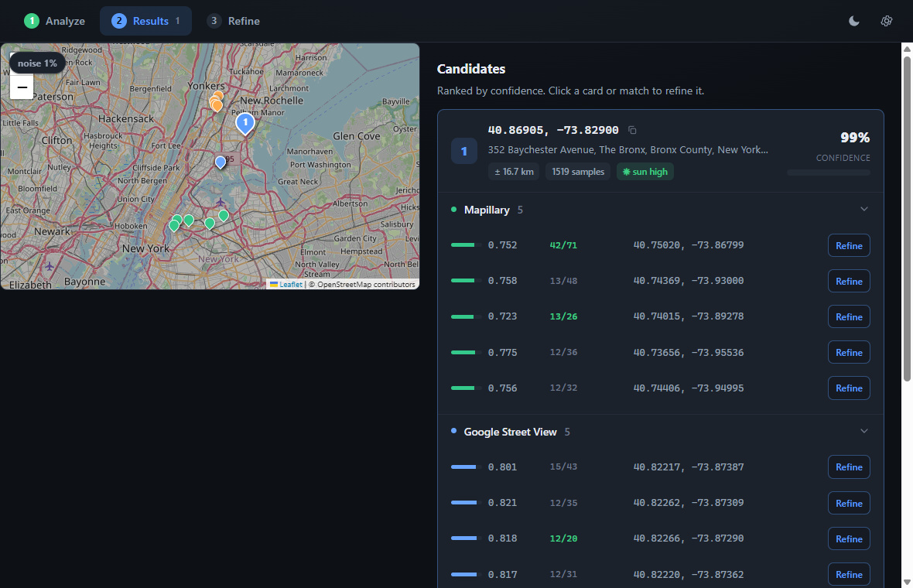

<div align="center">


# Waypoint

**Free, open-source image geolocation. Figure out where a photo was taken.**


</div>

<p align="center">
  
</p>

## What it is

Waypoint takes a single outdoor photo and estimates **where on Earth it was taken**. It starts
with a neural coarse guess, sanity-checks it against the sun, then confirms the exact spot by
matching the photo against real street-level imagery. Every candidate shows up on an interactive
map with a confidence score you can drill into.

It's built for OSINT research, verification and journalism, and geolocation CTFs. Everything runs
locally; the only things that leave your machine are the imagery lookups the refinement stages make.

## How it works

<picture>
  <source media="(prefers-color-scheme: dark)" srcset="assets/pipeline-dark.svg">
  <source media="(prefers-color-scheme: light)" srcset="assets/pipeline-light.svg">
  
</picture>

1. **Coarse localization.** [PLONK](https://github.com/nicolas-dufour/plonk), a diffusion model, samples a spread of plausible locations and clusters them into weighted candidates.
2. **Sun / season plausibility.** Shadow direction and lighting get checked against the sun's position for the implied place, date, and time, downranking implausible guesses.
3. **Retrieval refinement.** Each candidate is compared against nearby real photos from **Mapillary**, **Google Street View**, and **Panoramax**.
4. **Geometric verification.** Promising matches are confirmed with local-feature matching (**DISK + LightGlue** via `kornia`). The inlier count tells you how solid a match really is.
5. **Refine.** Pick any candidate or match and run a tight, exhaustive search of a small radius around it.

## Features

- **Interactive map** (Leaflet + OpenStreetMap) with candidate and per-source match pins, auto-fit to the results.
- **Confidence, uncertainty, and evidence.** Cluster weight, sample spread, and the sun-plausibility verdict, all surfaced per candidate.
- **One-click refine.** Send any result into a focused, exhaustively-verified re-search.
- **Light and dark theme**, a three-tab workflow (Analyze, Results, Refine), no clutter.
- **No paid APIs.** Google Street View, Panoramax, and OpenStreetMap need no keys; Mapillary is optional and free.
- **Zero manual setup.** The app downloads its own portable Python runtime on first launch. No system Python required.

## Requirements

- **Windows 10 / 11 (x64).** _(macOS/Linux aren't supported yet; first-run setup fetches a Windows Python build.)_
- **[Node.js](https://nodejs.org/) 18+** and npm, to install and run from source.
- **~6–8 GB free disk** (PyTorch and model weights) and an **internet connection** for first-run setup, imagery lookups, and the model download.
- **Optional: an NVIDIA GPU** (CUDA), auto-detected for faster inference. Otherwise it runs on CPU.

## Install & run

```bash
git clone https://github.com/KillaMeep/waypoint-osint.git
cd waypoint-osint
npm install
npm start
```

### First launch (automatic, one-time)

On the very first run, Waypoint installs a **portable Python environment** for itself. It downloads
[`uv`](https://github.com/astral-sh/uv), a managed Python 3.11 interpreter, and the pipeline
dependencies (PyTorch and the rest). This takes a few minutes and shows a progress bar. Everything
lands in the app's own data folder; your system Python, if you have one, is never touched. You can
wipe and redo this anytime from **Settings → Purge Python install**.

### Optional: Mapillary token

The Mapillary refinement stage needs a free API token. Open **Settings**, paste a token from
[mapillary.com/dashboard/developers](https://www.mapillary.com/dashboard/developers), and save.
Without it, that one stage is simply skipped. Google Street View, Panoramax, and OpenStreetMap
work with no keys at all.

## Building a portable executable

```bash
npm run dist
```

Produces a standalone Windows portable `.exe` in `dist/` (via `electron-builder`).

## Under the hood

| Layer | Tech |
|-------|------|
| Desktop shell | Electron |
| Coarse geolocation | PLONK (`diff-plonk`) |
| Sun/season check | `astral` (sun position vs. OpenStreetMap road bearings) |
| Street-level imagery | Mapillary API · Google Street View · Panoramax |
| Feature matching | DISK + LightGlue (`kornia`) |
| Geocoding / roads | `geopy` (Nominatim) · OSM Overpass |
| Map UI | Leaflet + OpenStreetMap tiles |

## Ethical use

Waypoint is a research and verification tool. Use it responsibly and lawfully: for OSINT research,
journalism, imagery verification, and CTFs. **Don't use it to stalk, harass, or endanger anyone.**
Estimates are probabilistic, not proof. Always corroborate before acting on a result.

## License

[MIT](LICENSE). Free to use, modify, and distribute.

<div align="center">
<sub>Built on the shoulders of PLONK, Leaflet, OpenStreetMap, Mapillary, Panoramax, and kornia.</sub>
</div>
